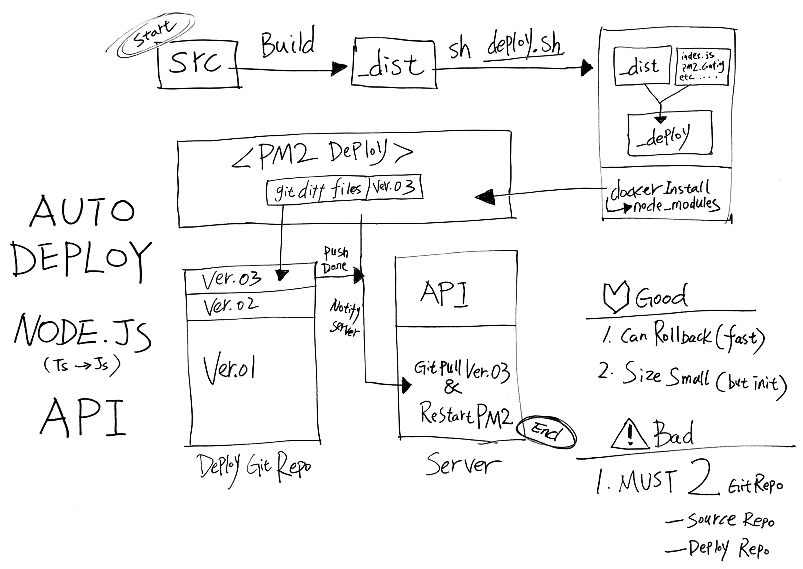
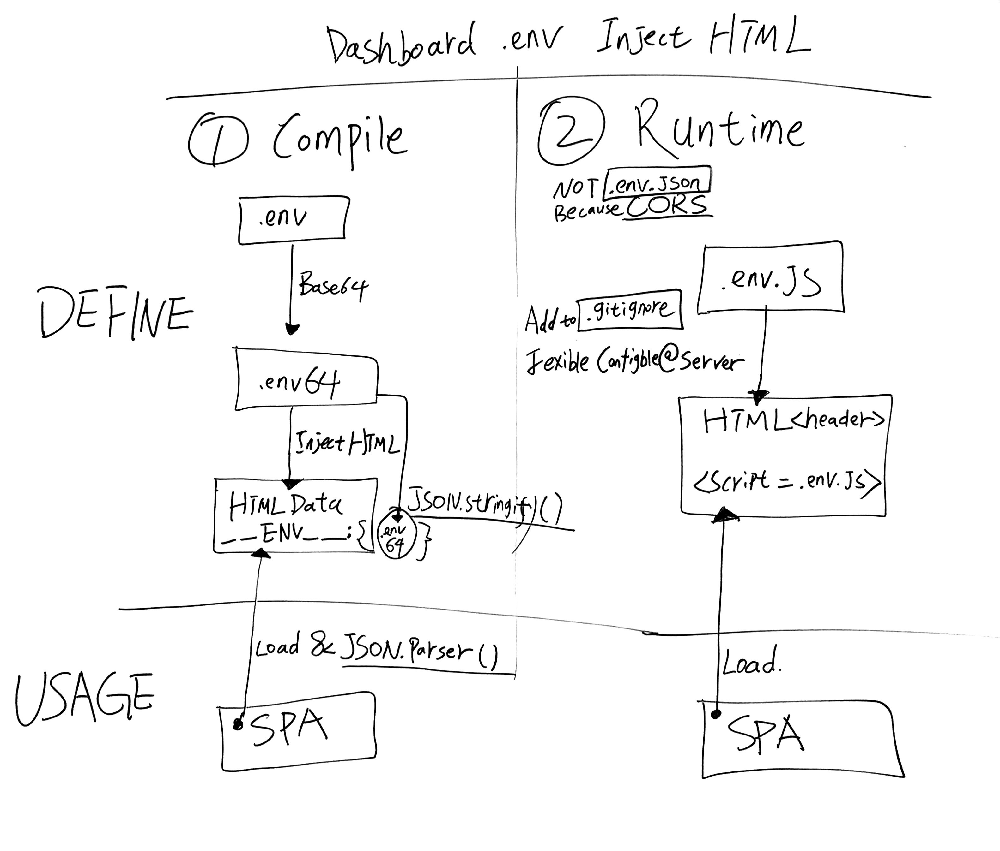

## **DEV SUMMARY**

本来总结应该写在文末，但我感觉还是提上吧，起码不用看我唠唠叨叨一堆开发日志。

以前老想着自己写一个全栈项目试着打通 5 端，苦于没时间，一直拖着，写的时候还以为需要大半年，但没想到现在只花了一个半月就做好了，而且很多地方我还最求了最佳实践，总体而言还算比较满意。

项目初衷是想用 `React` 或者说主要是 `JSX` 的语法来做更多的事情，比如写小程序或者 App，而且现有的技术框架也支持我这种想法，拿着以前的已有经验配上一些较新的技术比如 `GraphQL` 就开始上路了。

在 `api`，`dashboard`，`www` 这几个端上碰到问题不算多，但 `miniprogram (小程序，下文简称 mp)` 和 `app` 上就没那么幸运了，因为他们都不是标准的 `web 语言`，类似 `HTML 富文本` 渲染这种在 `web` 上天然支持的功能，到了他们上面就变成 `fuckingSelf` 需要自己解析了，比如 `a` 链接，因为在 `mp` 和 `app` 中并没有 `a` 链接的说法，用户点击 `a` 后会发生什么完全由开发者自己决定，这和我以前开发的 「`web` 应用」完全是两种概念。倘若以前有过 `App` 开发经验，相信要躺的坑会变少许多。

说到坑，我觉得我这一手坑挖技能真是了得。`RN` 以坑多而红想必已人尽皆知，好，我选了。`monorepo` 的坑大家可能不了解，但的确也是能把人坑得死去活来的，好，我选了。用 `TS` 开发 `RN` 的坑不多，但也不少，好，我也选了。然后就变成了选择了这个 `RN` + `monorepo` + `TS` 超级大坑（哭），不过后面我还是一点点的躺了过来，实在佩服自己的耐心（摊手）。

为什么会选 `monorepo` 这种方式开发呢？我的初衷是 5 端共享 TS 的 `interface` 和一些可复用的配置，但是后来写 `mp` 和 `app` 的时候发现，由于他们的一些特殊机制，我没办法给他们共享。实际上 `mp` 和 `app` 算是和 `monorepo` 完全隔离的，如果后面我重构代码，我会把这些 「`非标准 web 应用`」单独放一个 repo，因为他们真的很难伺候，`node_modules` 也是自有一份无法共享，每份体积都很大。大到不是关键，关键是每次 `yarn install` 的时候非常非常满，CPU 狂飙感觉电脑都要起飞了。本来我是倾向于能用 `yarn workspaces` 解决的 `mono` 就不用 `lerna`，但因为这个问题我尝试着上了 `lerna`，可问题似乎没得到好转，只好作罢。这一次用 `monorepo` 真真切切的给到了经验，算得上是拳拳到肉的疼，也让我知道如何取舍 `mono` 和 `multi`。

好，如果现在让我写一个 5 端难度排行，我认为会是这样 `mp` > `app` > `www` > `api` > `dashboard`。

为什么会把 `mp` 列为最难的部分？因为 `mp` 不单有很多私货，而且 devtools 也 bug 多得出奇，有时候我修一个 bug 修半天没好，结果重启一下 devtools 就好了，这个真的是要气吐血。而且因为我用了 `Taro`，很多新的功能比如 `custom-tab-bar` 没跟上，文档都没有，我自行摸索弄是弄出来了，但也花了不少时间。当然，如果你用 `Taro` 同时有 `custom-tab-bar` 这个需求，`leaa` 可能是目前全 Github 已有方案的最优解。

另外关于 `www` (`Next.js` v9) 我本来也有很多想说的，但随着时间流逝，这些想说的慢慢变消失了，而这种「不想说」并不是那种「难者不会会者不难」的不想说，而是因为 `Next.js` 坑太多，解决一个坑必定会引发另外几个坑，而且官方都没有什么最佳实践给你参考，都是一些简单的 `example`，一旦想要做一些复杂的功能，这种前后端都要处理的「SSR」的确让人有种「难言之隐」的感觉。随着每一次 `Next.js` 大版本的变动如 8to9，都会有很多断崖式的改动，没办法啦，zeit 的文化就是这样，只能用「一切的不如意都源自于自己不够强大」来安慰自己。

出于 `monorepo` 的原因，有非常多「文件名相似」的文件在一个项目里，很多时候有种被文件淹没的感觉，在找文件的时候很容易被干扰，即便是我放弃了用 `Components/Filter/index.tsx` 改为用 `Components/Filter/Filter.tsx` 去给文件命名，以求 `cmd` +。`p`，能快速定位到文件本身而不是目录，但也难以摆脱这种「文件地狱」的感觉。

本来说好写总结就不要不抱怨了，但现在看来多多少少还是有一些吐槽，Anywhere，从 `Docker` 到 `Api` 再到 `UI/UX`，写 `leaa` 过程的确让我学到很多，对软件架构、开闭原则有了更深的了解，以前写项目觉得「编码」与「建筑」其实是做着同一件事情， 这次算是更深刻的体会到了。

目前 `leaa` 还有很多很多很多 bug，但这似乎不妨碍有需要的人通过 Github 上检索到 `leaa` 中对他们有用的代码，这也是我写 `leaa` 的东西，以上。 2019-09-17 17:01 @ Guangxi Hezhou

## **DEV LOG**

### 2019-08-01 23:39

从 git commit 可以看出，这篇 DEV LOG（开发日志）是现在才开始写的，项目本来叫做 1d1h，也就是一天一小时的意思，想着业余时间把之前写前后端的经验汇集起来，做个 Blog -> CMS -> Sohp 的开源项目，包括 API / Dashboard / Website / Wechat Weapp / React Native (iOS / Android)，因为是一套 monorepo，类似 interface / entry 这些都是共用的所以感觉做成全平台也是一件很顺手的事情。

其实本来想早点写这个开发日志，但早期一大堆需要解决的问题，时间都用在开发上了，实在抽不出时间写记录，现在想想还真不应该这样，毕竟之前的一大堆问题如果记录下来了，其实就是隐形财富，虽然再次遇到了自己肯定懂如何解决，但就没办法 share 给其他人了。不过接下来的日志我会慢慢回顾就对了。

这里说一下我对 Dashboard 的理解吧，我觉得一个最小可用的的 Dashboard 应该包括。

- 用户（登录 / 注册）
- 角色
- 权限
- 文件上传
- 广告
- 分类
- 文章
- 设置

这几个模块写完基本上就可以拿来当 Blog 用了，特别是角色权限这块，如果有业务需求，基于这样的最小化的 Dashboard 开发基本上可以说也很简单了。我在以往的项目里处理权限已经很多次了，不过这次因为是 graphql，和之前的 restful 稍有区别，还是花了一些时间折腾的。

用 Nest.js 写了那么多的代码，其实算不上舒服，选用的原因其实还是看中了他的一整套范式以及武装到牙齿的 Typescript 支持。作者 @kamilmysliwiec 还是非常厉害的，Nest.js 的一些封装实现非常精妙，最重要的还与各种技术相结合，落地了很多业务场景，这点真的非常赞的。

**`dashboard`** 上技术选型时常见的 React + Antd，不过这次因为全面上了 `hooks`，包括 Apollo 都是最新的 hooks beta 版本，整个项目几乎见不到 Class，但在大规模使用 hooks 后，感觉代码长得实在难看，如果以前 Class 代码清晰度打 10 分的话，hooks 只能打 5 分。当然，最明显的应该是赚了一个代码 Fn 共享，换做是 Class，想要 share Class 的 Fn，还是挺麻烦的。

**`www`** 部分没得选，只能是 Next.js 了，其实之前我有自研过一套较为完备的 React-SSR，但为了顺应浪潮，加上 @Guillermo 神在推上天天天吹，忍不住还是入手了 Next.js。我开始写 www 的时候刚好赶上 Next.js v9 发布，这是一个从 core 就开始用 TS 重写的船新版本。本以为用起来会很顺利，但没想到还是坑了……

毕竟需要集成 Antd，即意味着，Client 自己的 pages 代码需要对 less 用 cssModule，Antd 则不用，Server 那边则是看到 less 就扔。所以官方提供的 withLess 插件最多只能管 60%，剩下 40% 支持不到位。本来像 Next.js，CRA 这种就是把 webpack 包起来，前端毒瘤真不想你碰，配一下都是炒鸡麻烦。

但，我想说一个框架在项目初期给你几倍便利，那么它便会在项目后期给你带来几倍麻烦。CRA 如此，expo 如此，Next.js 也不例外，都是黑盒。那么我必须在两个小时内写一个 100% 符合我预期的 withPlugin 来，不然项目就卡了。翻了翻 Github 想看看有没有解决方案，但很不幸， v9 刚出根本找不到相关代码，看起来，只能 fuckingself 了。我虽对 webpack 很熟，但这 Next.js 在 webpack 上加了薄薄一层黑盒，写 withPlugin 有种被淹没在未知的 context 海洋中，是种非常憋屈的赶脚，不过还好，最终半小时搞定。提了个自带 resolve 的 [issue](https://github.com/zeit/next.js/issues/8054) 趁没被人发现赶紧 close 掉。希望给碰到同样问题的伙计在搜 issue 的时候带点帮助，毕竟需要 Next.js + antd withLess 的人还是很多的，特别是国内。

<br />

### 2019-08-15 20:45

时间过得好快，转眼半个月，最近没给 leaa 写什么新东西。重点放在了阿里云 OSS 整合这块。想要实现这样一个功能：

- Local 上传
- OSS 上传
- OSS 上传后备份到 Local
- OSS 上传 @2x 图片后，生成 @1x 上传回 OSS
- OSS 上传 @2x 图片后，生成 @1x 上传回 OSS 并备份到 Local
- 删除 OSS 需要触发删除 @1x 和 @2x 文件，并删除 Local 中的 @1x 和 @2x
- Local 和 OSS 是否开启均可配置
- 如 OSS 开启，为保证用户上传速度，所有上传直接走 OSS

其中过程还蛮艰辛的，涉及到 Local 和 OSS 之间的一些交互，而且因为直接走 OSS，所有请求不经 API，变成了等待 OSS 的 Callback，必须保证任何一步没做完都不能动 DB，勉强达到了幂等。
其实如果上传都走 API，然后由 API 统一处理再 put 到 OSS 会简单非非非非非非非常多，我这么做主要是担心做某些活动的时候，如果涉及到上传文件，并发就会很大，服务器缓不过来。所以拿 OSS 先挡一下还是很有必要的。

基本上 www 和 api 以及 dashboard 就告一段落了。明天开始 `miniprogram`。

<br />

### 2019-08-16 12:04

刚整理 package 的时候发现 React 升级到了 16.9.0，console 下一堆类似的 `Warning: componentWillMount...`，看了一下 React [CHANGELOG](https://github.com/facebook/react/blob/master/CHANGELOG.md#1690-august-8-2019) 发现的确是大改，未来版本要废弃几个 `lifecycle`。由于 leaa-dashboard 依赖 `antd`，所以还是等 `antd` 发版消除了这些 warning，再升上去。目前 React 是锁在 `"react": "16.8.6", "react-dom": "16.8.6"`。

<br />

### 2019-08-16 15:07

做了一个 Leaa Stack 的 Banner 放到 README 顶部，用图片描述使用的技术比文字好不少。另外提一下 `Leaa` 这个名字，这其实是我喜欢的一个法国女演员 [Léa Seydoux](https://zh.wikipedia.org/zh/%E8%95%BE%E9%9B%85%C2%B7%E7%91%9F%E6%9D%9C) 的名字，避免重名率过高，我在 Lea 后面多加了个 a。不过 `LEAA` 在 Google 最多的指向是 `Law Enforcement Assistance Administration` 美国一司法机构（笑）。

<br />

### 2019-08-17 11:21

刚在用 lint 在给项目做全面检测发现了几个 error，比较有趣的是 `packages/leaa-dashboard/src/pages/Permission/PermissionList/PermissionList.tsx` L159 这里，项目 `.prettierrc` 的 `printWidth` 和 `.eslintrc.js` 的 `max-len` 都设置成了 `120`，但这里 prettier 不报错，也不自动格式化，但是 eslint 和我说这里超 120 了。

我只好加了个 `eslint-disable-next-line max-len`，感觉很有可能他们其中一个是用了 `>` 一个是 `>=`，但是我去修改了两者的属性后发现不是这个问题，算了，先加个 max-len，目前只有一处是只有，标本不够就先不处理了。待日后这个问题多了再统一处理。

<br />

### 2019-08-17 14:16

虽然自己很注意 style code，也会用 IDE 配合 keymap 写 marco 套用 `prettier` 和 `eslint` 规则做 format。但项目 public 之后可能会有 contributors 进来（不，不会的 hhh），觉得还是在 `git commit` 卡一下 code style 会比较好。

通常项目上一个 [`husky`](https://github.com/typicode/husky) 就够了，但是 monorepo 文件那么多，每次 `git commit` 全 packages 所有文件都 `eslint` 必然会卡到爆，所以肯定是要配合 [`lint-staged`](https://github.com/okonet/lint-staged) 做最小化 eslint 处理的，只让此次 git stage 中文件去跑 eslint。

可是貌似官方没有给出太多针对 monorepo 的建议和范例。摸索了一番，发现其实也不麻烦，只是和 non-monorepo 不大一样而已。为了和 `pacakge.json` 解耦我还特意写成配置文件，大致长这样：

```javascript
module.exports = {
  'packages/**/*.ts?(x)': ['prettier --write', 'eslint', 'git add'],
  'packages/**/*.(css|less)': ['prettier --write', 'stylelint', 'git add'],
};
```

试了一下，速度还是蛮快的。要有更好的最佳实践可能还得用一段时间才知道效果了。

<br />

### 2019-08-18 11:42

试了大概一个晚上的 `Taro`，感觉不是特别理想，为什么呢？首先我需要的是一个 `React` to `小程序` 的框架，而且想要的是 `ONLY` 小程序，至于为什么是 ONLY，后面我会展开详细说明。

初步使用下来，感觉 `Taro` 感觉是一个集大成者，他身上的责任还蛮重的，需要兼容太多的 `类小程序` 环境，比如 `支付宝小程序`，`今日头条小程序` 等…… 而且还要考虑兼容 `RN` 那不友好的 `yoga` CSS 引擎，团队还是非常不容易的，能做到这这个程度，我还是非常佩服的，这里必须先给个赞。接下来我讲一下我几小时下来大概的感触。

##### H5 端

完美！正常 Web 开发一样，没什么好说的。支持 HRM，支持 css module。不用关心 `webpack`，上来就能 run。不过有一点值得注意，就是如果想要兼容 `RN`，那就不能用 [`taro-ui`](https://github.com/NervJS/taro-ui) 或是别的什么第三方 UI lib，只能使用内置的 `@tarojs/component`，这个限制感觉卡得比较厉害，期待 `taro-ui` 早日支持 `RN`。

##### 小程序端

也非常完美，说不上没什么不好的地方，run 起来后，打开官方微信 debug tools 顺利走起。唯一坑点是对 `monorepo` 支持不友好，当然这点也无可厚非，国内本来用 `monorepo` 的就少，用了肯定要自定义为「自己有能力解决 `monorepo` 上的任问题」的态度。我在 `monorepo` 下 run，遇到的是这个问题：

```
can't find module : ../../../node_modules/@tarojs/taro-weapp/
```

社区上也有一些人在提 issues 比如 [需要 monorepo 支持](https://github.com/NervJS/taro/issues/3116)，我的做法和他差不多，都是用 yarn wokespaces 的 [nohoist](https://yarnpkg.com/blog/2018/02/15/nohoist/) 去做处理，只不过我的方案是只让 `Taro` 相关的模块保留在 sub-package 下，别的该提升还是提升，最大化 share 了 modules：

```json
{
  "nohoist": ["**/@tarojs/**"]
}
```

##### React Native 端

看 `package.json` 里的 有 `dev:rn`，我就 run 了，结果是好的，看到提示编译成功，但就没有下文了…… 然后去官方 [docs](https://nervjs.github.io/taro/docs/react-native.html) 看了下，感觉略复杂，那这和单独折腾一套原生 RN 开发有什么区别？而且依赖 `Taro` 的话，`RN` 版本锁在 `0.55.4`,天啊！这和官方目前 `0.60.x` 的版本号相距甚远，要知道 `RN` 每一个版本迭代都是质的飞跃，如果用上 `0.60.x` 还能在 Android 上赚一个 [Hermes](https://github.com/facebook/hermes)，效率也是大幅提升。另外还有一个让我顾虑的是，用上`RN@Taro`，意味着只能使用 `@tarojs/component` 这个 UI lib，也就是意味着要放弃掉 [`NativeBase`](https://docs.nativebase.io/) 和 [`Shoutem`](https://shoutem.github.io/docs/extensions/tutorials/getting-started) 这两个在 `RN` 上相对优质的 UI lib。

嗯…… 综上考虑，如不是一心想为了节约成本和时间，想着 `一套代码多处运行` ，目前还是建议放弃 `RN@Taro` ，如果要说一个最佳的切入时机，我认为是至少 [`taro-ui`](https://github.com/NervJS/taro-ui) 支持了 `RN` ，当然，这个代价实在太高，官方永远不去做支持也是非常有可能的。

好啦回到正题，我使用 `Taro` 的初衷一开始就是用来 ONLY for 小程序的，所以对于目前的情形我觉得「一切 OK」。`leaa-app` 那边还是 `RN` 或者 `expo` 处理就好，毕竟坑基本上在以往项目踩完了（笑）。

<br />

### 2019-08-18 22:18

记录一下今天白天用 `Taro` 的心得，真是满满的心酸啊……

- 首先，比较痛苦的是不支持 `@apollo/react-hooks` 和 `react-apollo`！也就是说，任何 Apollo 官方的包都不可以用了！不能 `useQuery` 连 `<Query>` 都不让，用就给你报 hooks 那经典的错误 `Invariant Violation: Invalid hook call.` 结果是直接用写好 export `apolloClient` 后 `apolloClient.query()`，这真是一夜回到解放前啊！

- 本来想着方便，在 `H5`模式下 debug，`apolloClient` 这种方式能跑起来已经很开心了，没想到…… `小程序` 模式弹 error 了，说 `fetch is not found globally and no fetcher passed, to fix pass....` 查了下资料说是 「微信小程序在某一次升级中， 移除了全局的 fetch」这……，还好，马上找到了前辈写的 lib [wx-apollo-fetcher](https://github.com/kdong007/wx-apollo-fetcher)。整个库就几行：

  ```
  return new Promise(resolve =>
  wx.request({
      ...
      complete: ({ data, statusCode, errMsg }) => resolve({...})
  }))
  ```

  然后在 `HttpLink` 那边替换一下变成 `fetch: wxApolloFetcher` 就好了。万万没想到微信还会做这种断崖式更新，真是骚操作。

- 再就是路径 `alias` 的问题，[官方 issues 这贴](https://github.com/NervJS/taro/issues/1598)讨论得最激烈，我看完后试了，依然无解。这里的无解是 `小程序` 端无解，`H5` 端是好的。这…… 我这好歹是 `monorepo`，要是不能 share `@leaa/common` 包里的代码，那会变得很尴尬。行吧，我先不复用，忍忍。

本以为经历过 `RN` 的开发已是煎熬，但这次…… 哎，不说了，怪自己用的技术太新（啪）。

<br />

### 2019-08-19 15:26

托 `Taro` 的福。折腾了半天 `alias` 的问题在 `小程序` 模式下是彻底无解了。不过在解这个问题的同时有一个新发现。就是 `monorepo` 其实不应该在 `tsconfig.json` 写 `alias paths` 的。之前我的做法是这样。

```json5
// tsconfig.json

{
  compilerOptions: {
    paths: {
      '@leaa/common/*': ['../_leaa-common/src/*'],
      '@leaa/api/*': ['./src/*'],
    },
  },
}
```

```text
// .babelrc.js

plugins: [
  ...
  alias: {
    '@leaa/common': '../_leaa-common/src',
    '@leaa/api': './src',
  },
  ...
],

```

```text
// package.json

"dependencies": {
  "@leaa/common": "^0.0.2",
  "@leaa/api": "^0.0.2",
}
```

一共有三个地方要写 `alias`，如果加入了 `jest`，还需要在 `jest.js` 写上:

```text
// jest.js

const { pathsToModuleNameMapper } = require('ts-jest/utils');
const { compilerOptions } = require('./tsconfig');
...
moduleNameMapper: pathsToModuleNameMapper(compilerOptions.paths, { prefix: '<rootDir>/' }),
...
```

这是图什么呢? 就图个在 import 的时候可以这样：

```text
import { JwtStrategy } from '@leaa/api/strategies';
```

而不是：

```text
import { JwtStrategy } from '@leaa/api/src/strategies';
```

天啊，就为了少些一个 `/src` 做了那么多工作，感觉不合理 ! 非常不合理！必须统统改掉。~~只在 `package.json` 加入 `dependencies` 就好~~，只在 `package.json` 和 `tsconfig.json` 加入 `path mapping` 别的都删掉。

1， 2， 3，好，改完了。

那回过头， `.babelrc.js` 的 `module-resolver` 有没有用呢? 当然也是有的咯，我觉得如果不是 `monorepo` 的时候用来以 `@utils` `@graphqls` 这种代替真实目录就很好啊。不用写一堆 `../../../../../` 但是如果是 `monorepo`，觉得直接 `package.json` 直接依赖就好，简单明了。

<br />

### 2019-08-20 01:23

今天 coding 的时间不多，大部分时间都在忙别的，基本上 `Taro` 前期的坑已踩得差不多了，唯独 `alias` 的问题还在卡着。研究半天，感觉实在无解了，比较迷。

`Taro` 有个机制还蛮智能的，就是会在 `dist` 下建一个 `npm` 目录，发现代码里 `import` 了什么就 copy 什么进这个目录，而且是按文件引入并不是整个 lib 都给你拷过来，很赞！和 `@zeit/ncc` 很像。

但因为我是 `monorepo`，这个功能好像不能识别私有包，一旦发现私有包就不 `copy` 了，我也试过手动把私有包放进去，结果无效，我猜也有可能是发现文件不是 `.js` 就不 copy 了。

所以情急之下我动了 `软链接` 的念头。其实我一直不想在 `Code` 层面动 `OS` 的东西。但现在实在没办法，来吧！考虑到各 OS 兼容性问题，我没敢直接用 `ln -s`，而是用了 node 自带的 `symlink`，当然，在 windows 下的兼容性我也不敢打包票，因为看手册发现 `symlink` 在各系统下的行为也是不一样的……

好，上代码片段：

```javascript
// symlink.js

const sourceDirPath = path.resolve(__dirname, '../_leaa-common/src');
const distDirPath = './src';

const symlinkPaths = ['graphqls'];

symlinkPaths.forEach((path) => {
  const sourcePath = `${sourceDirPath}/${path}`;
  const distPath = `${distDirPath}/${path}`;

  if (fs.existsSync(distPath)) {
    fs.unlinkSync(distPath);
  }

  console.log(`SYMLINK: ${sourcePath} --> ${distPath}`);

  fs.symlinkSync(sourcePath, distPath);
});
```

总体来说代码还是非常简单的，在 `package.json` 里，每次 `dev:weapp` 前都会执行 `symlink.js` 删软链 --> 建软链，其实就相当于删几个文件而已，对硬盘寿命的影响可忽略不计。

真的没想到一个小小 `alias` 问题我能折腾那么久，而最后方案又是如此简单明了。真是想哭啊……（哭）。

<br />

### 2019-08-20 13:47

发现小程序有个坑，就是支持了 `Promise` 了，但是不支持其中的 `Promise.finally()`。理论上讲标准 Promise 只有 `resolve`、`reject`、`all`、`race` 四个方法。没有 `finally` 也是合情合理的，但由于小程序模拟器用的是高版本的 Chrome，默认支持支持 `finally`，但到了真机上就不支持了，乖乖～ 好迷。

我写代码的时候会习惯性的在发请求的时候加个 Loading UI，等数据拿到（或没拿到）的时候再把 Loading UI 去掉。

如果有 finally 的加持，只需要在 finally 里写一次去掉 Loading 即可，但如果不支持，then 和 catch 都要写，略显麻烦。不过也有曲线救国的解决办法：

```text
try {
  ...
} catch(e){
  ...
} finally{
 ...
}
```

但这毕竟要 async，在 hooks 里，能不 async 还是不要，主要是在 `Taro` pages 下使用 async 会有奇奇怪怪的问题，暂时不考虑这种方案。

所以最终方案还是 `fucking-self`，其实写一个 `Promise.finally()` 不难：

```javascript
Promise.prototype.finally =
  Promise.prototype.finally ||
  {
    finally(fn) {
      const onFinally = (cb) => Promise.resolve(fn()).then(cb);

      return this.then(
        (result) => onFinally(() => result),
        (reason) => onFinally(() => Promise.reject(reason)),
      );
    },
  }.finally;
```

但是写好非常难，为了避免手写代码的可靠性，还是用 lib 吧，网上找了很多相关的 lib，发现还是 [promise.prototype.finally](https://www.npmjs.com/package/promise.prototype.finally) 最好，同等体积下实现最好。

使用的时候直接在 `app.tsx` 下调一下即可，简简单单。

```javascript
import promiseFinally from 'promise.prototype.finally';
promiseFinally.shim();
```

好了，又 polyfill 一个坑。

<br />

### 2019-08-21 11:43

今天在 Taro 上做 `CustomTabBar`，说实话有点窝火…… 本来官方一个简简单单的 [demo](https://developers.weixin.qq.com/s/jiSARvmF7i55)，用小程序原生代码，几分钟就能搞定。无奈 Taro 官方并没有这样的 `example`，doc 上也没提，需要自研。还好找到唯一一个官方线索，就是这篇 issues [大神，微信小程序支持自定义 tabbar 了，Taro 支持吗现在 #2240](https://github.com/NervJS/taro/issues/2240) 。

我的想法是自定义 `CustomTabBar`，用 svg 去代替 png 做 icon。前段时间看到微信官方 push 了消息说支持 svg，刚试了一下，果然支持了！但是…… 这个问题和之前 `Promise.finally()` 问题一样，就是模拟器支持真机不支持，靠北喔！想掀桌！感觉一次两次被小程序模拟器耍，难道微信官方都基于 `Blink` 二开了，在 console 里面 Tips 一下模拟器与真机的区别就有那么难吗？算了，别抱怨了，感觉还是自己能力有限。那怎么办？还能怎么办！填坑！一定要把这个问题 BAN 了！

其实我是用不到 `CustomTabBar` 的，费那么大力气去搞他干嘛？ 但是想着以后业务总有可能会用到的，先开荒一下，而且我个人也实在不是特别喜欢用图片去做 icon，因为个 icon，两个 status。要改大小还得改图，图 size 不对还有毛刺…… 放着好好的 svg 或 iconfont 不用干嘛呢？结果一搞就是一个晚上。

来，先贴一下关键代码：

```text
// custom-tab-bar/index.tsx

// 控制 action class 样式
className={cx(style['item'], { [style['item--action']]: selected === index })}
```

```text
// home.tsx

componentDidShow() {
if (typeof this.$scope.getTabBar === 'function' && this.$scope.getTabBar()) {
             这里是关键 -------|
                              v
  this.$scope.getTabBar().$component.setState({
    selected: 0,
  });
}
}
```

老实说如果没有那个 issues，我真不知道 Taro 还有 `this.$scope` 这个用法，虽然 Taro 看着和 React 差不多，其实也还是有很多私有扩展的，我甚至至今都没有搞清楚 Taro 到底依赖了那个版本的 React，按理说应该是 `16.8` 以上吧，因为支持了 `Hooks`，但又不确定，官方也没在明显的场合露出过这个信息，恐怕也不大想让开发者知道吧，用就行了。

BTW-0，这里说个小缺点，就是为了用上 `CustomTabBar`，所有在 `CustomTabBar` 中的 TabPage，是需要用 `Class` 方式写的，因为官方目前还没有提供 `Hooks` 版本的 `this.$scope`，但愿后续官方能支持。

BTW-1，据网友纠正，Taro 的内核是 [NervJS](https://github.com/NervJS/nerv)，一个 React-Like。其实 Nerv 在 Taro Doc 上经常见，没想到 Taro 是真的完完全全依赖了这个自研的 lib。佩服，不过想来如果要兼容多端，扩展 React 肯定是不够的，必须要掺一些私货才能满足需求。

<br />

### 2019-08-22 11:55

插一条 Ops 相关的记录，今早收到了 heroku 发来的邮件，说我每月 1000 的 dyno 额度以消耗 80%。之前为了 leaa demo 能有更好的可用性，为不让在 heroku 上的 App 在 30 分钟无访问后自动休眠，到 [uptimerobot](https://uptimerobot.com/) 开了一个监控服务，设置成每 29 分访问一下那几个 demo。

然后知道今天收到邮件我才明白，原来这个 dyno 额度账户内所有 App 实例共享的，也就是我 3 个 App，如果以 30 \* 24 小时跑 30 天那就是 2160，hhhhh 那必然会超。

当然啦，这也不是什么大问题，之前为了免费部署的事，对市面上所有自带 `git hook` 且有免费可用额度的 serverless 都轻车熟路。按现在这种状况，我也只好在 heroku 上只挂 `leaa-api`，而 `leaa-www` 和 `leaa-dashboard` 就先部署到 [now.sh](https://zeit.co/) 吧。

之前有朋友说为什么不弄一个 VPS 去部署这些 demo？我其实也不是懒，更不是为了省钱。只是觉得用 heroku 这类服务，可以省心不少，比如 `https SSL`, `git hook deploy`, `server maintain` 这些服务商都自带了。我都不需要去考虑，想想看还真是 `server` + `less`！我只管专心写代码，然后一个命令就把项目部署了。

<br />

### 2019-08-22 16:21

刚在测试小程序的登陆功能，感觉噩梦又要来了。是的，虽然之前开发过多次微信 Oauth 相关的业务，但是每次做微信的调试都感觉累觉不爱。不是要测试服务器就是要 `ngrok`，`natapp` 什么的去做穿透，特别特别烦人。

不过今天研究出一个方案，可以摆脱这些代理工具，那就是用 [微信公众平台接口调试工具](https://mp.weixin.qq.com/debug) 去发现你的 IP。

好，Show Time 开始：

1，注册公众号，最后一步弹出 IP 白名单你可以随便先填写一个，比如 `127.0.0.1`，这是为了避免待会用调试工具报：

```text
{
    "errcode": -1000,
    "errmsg": "system error"
}
```

2，接着去调试工具里填好，`appid` 和 `secret`，发请求，这时会返回。

```text
{
    "errcode": 40164,
    "errmsg": "invalid ip xxx.xxx.xxx.xxx, not in whitelist"
}
```

3，把那个 invalid IP 复制到白名单，再发请求，就会看到已经成功。

```text
{
    "access_token": "24_2A_6FbzJH...JOO",
    "expires_in": 7200
}
```

4，Show Time 结束。

不过后来发现，其实这个 IP 打开 [whoer.net](https://whoer.net) 就能发现，然后如果需要调试微信认证相关的，还是一样得开 `ngrop`，hhhhhhhhhhhh（秀哭了）。

<br />

### 2019-08-23 14:39

要吐血了，今天早上在 debug `ts-node-dev`，我怎么还调起了工具链了？哎，不说了，看这个 [Issue](https://github.com/whitecolor/ts-node-dev/issues/87)。我 TM 最后追都追到 [filewatcher](https://www.npmjs.com/package/filewatcher) 这种级别的 lib 里去了，但问题依旧。

### 2019-08-27 23:35

好几天没写开发记录了，最近因为小程序需要登陆，为方便 debug，先过来 `leaa-www` 这边写了微信 `OAuth` 登陆。然后想说既然做了，就把 `leaa-www` 从 `heroku` 迁到 `now.sh` 吧。但…… 没想到的是，就这个事情真是让我操碎了心，妈的！（对，我这里爆粗口了），为了把 `Next.js` 部署到 `now.sh` 居然需要在 `next.config.js` 开启 `target: 'serverless'`，然后我测试的时候发现开了 `target: 'serverless'` 后居然取不到 URL 的 query（?后面的部分）。

ZEIT 大哥！`Next.js` 这可是你自家的服务啊，有必要限得那么死吗？ `target: 'serverless'` 就不能作为 Option？网上找了下，看到这个 [Intercepting popstate](https://github.com/zeit/next.js#intercepting-popstate)，作者说是故意这样设计的（估计也是无奈），当然，除此之外网上还有若干方法比如在 `now.json` 写正则路由匹配拿到 `query`，我干，这可是 code 啊！code 不应该和 deploy 绑死吧！这是基本的底线。我不可能为了这个需求去 hack 我的 code 啊！

又继续折腾若干小时，无果…… 怀疑人生了。容我再想想吧，感觉还是去改 code 好了，改成 `non-serverless` 和 `serverless` 都兼容，毕竟现在除了 OAuth 那边，需要 `query` 的地方还不是特别多。

### 2019-08-28 19:30

写了个两个脚本，把 `leaa-www` 和 `leaa-dashboard` 部署到了 `now.sh`，之前也想过把 `leaa-api` 也部署过去，但到目前为止，凡调用了 `TypeGraphQL` 这个库的 App 均无法部署到 `now.sh`，整个 Github 都没有成功部署的案例。原因很简单，即 `ncc` 不支持 `Typescrpit` 的部分方法，具体可以看我提的这个 [Issues](https://github.com/zeit/now/issues/2680)。

好了！绕一大圈回来回来，终于可以继续写小程序登陆了（摊手）。

### 2019-08-29 19:37

小程序目前实现的功能较少基本上只有，`首页`，`文章列表`，`我的账户` 这三大页面，然后项目的难点我觉得其实是没有的，如果实在要说有什么折腾到我的，可能就是 `custom-tab-bar` 和 `HtmlParse`，这两个官方文档没怎么支援，都靠摸索而来。

再就是小程序的登陆还曼绕的，因为不是正式环境，每次 `natapp` 的域名前缀过期了都要把好几个 `.env` 重配一下，非常考验耐心……

趁现在还记得，写个小程序授权流程流程：

- 用小程序自带的 `wx.login()` 拿 `code`
- 拿 `code` 经服务器换来 `sessionkey` 和 `code`
- 拿 `sessionkey` 经 `wx.getUserInfo` 换 `userInfo`（需 withCredentials: true，以及用户点选授权）
- 授权成功，得到 `encryptedData`，`sessionkey`，`iv`，经服务器 `encryptedData()` 换 `用户信息` 和 `openId`（如需要 `unionID`， 请先在开放平台关联小程序和公众号）
- `用户信息` 和 `unionID` 拿到后就可以对比是否注册，做一些 DB 操作，返回 `用户信息`
- 用 `wx.setStorage()` 把拿到的 `用户信息` 存起来

啊！！！心好累，走了那么久终于走完小程序了，接下来是 RN，看了下 `expo` 目前 `sdk.34` 还不支持 `Hermes`，但是 [Blog](https://blog.expo.io/expo-sdk-34-is-now-available-4f7825239319) 有提到就要支持了，我觉得应该在 `sdk.35` 就可以用了。或者这次用用看原生 `RN`，anyway，看开坑把。

### 2019-08-30 16:13

插个不相关的 LOG，因为 `leaa` 告一段落了嘛，昨晚一口气把「怪奇物语」看完了，看得比较爽（大半夜的），然后睡觉的时候忽然想到一个比较靠谱的个人 blog 部署方案。

大概思路是用上：

- `Github Issues API`（自带完美的编辑器，Ctrl + V 即可贴图）
- `Github CI`（自动构建）
- `Github Page`（静态页面，真· Github 全栈）
- `now.sh`（用户留言 POST 到 `now.sh` 触发 `Github Webhook`，生成 `.js` 的留言文件）

不过`需要部署`本身其实就是一个大问题，写个日志都要搞一堆编译也是烦人，我之前有个 [blog](https://solidzoro.com/)，但我不是特别爱在上面写东西，因为光想到后面那一堆部署工作就累。虽然已实现了自动化的 `write iessue, building log`，但总之需要有个「前期工作」就觉得是麻烦事。所以快荒了两年，现在反而是在 `DayOne` 上写得比较多，因为方便嘛。当然 `DayOne` 也可以做到 `building log` 这一步，但还是之前说的……「麻烦」，呼，看来作为一个开发者，折腾点写东西的工具都那么多讲究，不是件好事（笑），难怪那么多开发者都入微信公众号的坑，hhhhhh 想想，这才是最佳之选啊！

### 2019-08-31 22:13

好啦，这回终于 init 了 RN，最终选型依旧是 `expo`，因为前期如果没涉及到「自定义推送」和「过于原生」的调用的话，还是 `expo` 方便一些，未来如果有需求再 `eject` 也没问题。

不过因为 `expo` 默认不支持 monorepo，需要上 [expo-monorepo](https://github.com/Fried-Chicken/expo-monorepo) 去解决。但我个人觉得这个方法有点 dafthack 就没用，和 `leaa-miniprogram` 一样采用了 `nohoist` 方案。

不得不说 `nohoist` 真是个效率大杀器，但同时也是硬盘大杀器，项目里不用 `nohoist` 的几个 package 加起来不到 20MB！因为到提升到了 `root-dir` 共享了。

但 `leaa-app` 一个 pacakage 在初期就达到了 200MB，`leaa-miniprogram` 更是达到了 370MB，也就是说 `leaa` 整个项目在完全安装的情况下差不多有 `1GB` OMG！虽说这个硬盘不值钱的年代开发环境体积不是问题，但我相信每个开发者都不喜欢占硬盘的大家伙吧，比如 `electron` App（哈哈）。

##### BTW1

因为 monorepo 的关系，无论 `yarn workspaces` 还是 `lerna`，其本质都是 `workspaces` 扩展。我实际用下来发现 `workspaces` 还是非常多奇奇怪怪的 bug 的，比如版本依赖不正确，有时候 `yarn add` 提示完成但实际却没有装上等…… 也可能我这里已经有 5 个 package 了，每个 package 又有比较复杂的依赖，导致了这些不稳定。对比之下，[babel](https://github.com/babel/babel) 就显得很稳定，自家 packages 多达百个，但也没见出什么问题，当然这个稳定可能和他们每个 package 依赖都不超过 10 个有关。

##### BTW2

如果我在 monorepo 的 `yarn install` 上遇到问题怎么办？最佳答案是 `rm -rf yarn.lock node_modules/`，基本上这个跑一次可解 99% 的 error，省时省心（笑）。

##### BTW3

最近使用 `Github CI` 发现有一些莫名其妙的问题，比如 `Travis CI` 过了但 `Github CI` 卡在 `package install`，我开始以为是我用 `taobao` npm repo 的关系，但是换回 `npm` 自家 repo 问题依旧，而且 `Travis CI` 1m 能跑好出结果的 TEST `Github CI` 需要 8m，这个差距还是有点大。

我之前开了 `Github CI` 多系统多版本交叉测试，每次 TEST 需要 10m+ 的等待，后来干脆只留一个但也还是慢。另外就是新建了 Action 项目还会有删不掉的 bug，看来目前 `Github Action` 处在 beta 还是有原因的，希望明年正式版上这些问题能够得到充分优化。

### 2019-09-03 00:40

进入九月啦！时间过得好快，不知不觉写这个开发日志已一个月，今天只说一件事，那就是 App 终于开坑并调好 `less` 和 `GraphQL` 啦。为什么 RN 可以用 less 哈哈哈哈，当然是加了点私货啦。

今天其实也很累，累在 `monorepo`，在 RN 上终于提示 `type-graphql` 这个库不能在非 `Node.js` 的平台上用，对的，RN 最后会翻译成 C++，也就是不符合 `Node standard library APIs` 的 lib 统统不认。

哎，这个实在是个麻烦事，因为我一大票 `DTO` 都是依赖 `type-graphql` 的，这下直接无法使用了，哭了…… 还好 App 这边不会调用太多的 Query，我只好手动转几个过来了。

其实我因为 `type-graphql` 这个 lib 卡了很多地方，比如不能 `ncc` 导致不能部署 `now.sh` 等，但目前类似的 lib 只有他一家，先等等看后续会有什么替代品再说了。

另外就是小程序那边已经做得差不多，我都没来得及截图和发布 demo，等 App 这边写了个大概再一并截图好了。

### 2019-09-03 21:57

发现 RN 上 `<FlatList>` 自带的 `onEndReached` 的上拉加载是个坑，嗯，天坑。比如这篇 [ReactNative 之 FlatList 踩坑封装总结](https://juejin.im/post/5aa66ae5f265da23826da0fc)，这篇 [onEndReached triggered 2 times](https://github.com/facebook/react-native/issues/14015)，这篇 [FlatList onEndReached triggered before reach onEndReachedThreshold](https://github.com/facebook/react-native/issues/12827)，这些文章都指向了一个问题，就是上拉后会多次调用 `onEndReached`，导致无限循环加载的问题。

我的解决办法比较粗暴，因为 API 可控，直接写了个方法返回文章 `nextPage`，如果没有就返回 `null`，其实类似 `items` `itemsCount` `total` `pageSize` `page` `nextPage` 这几个字段早应该包含在 `pageInfo` 里面的，因为写得匆忙，没有加上 `nextPage` 和 `itemsCount`，回头得统一加一下，或者干脆就统一使用 `paginationUtil.calcPageInfo()` 好了方便快捷。

### 2019-09-04 15:04

刚 RN(expo) 在跑 `dev` 的时候弹出：

```text
(node:10461) UnhandledPromiseRejectionWarning: Error: jest-haste-map: Haste module naming collision:
  Duplicate module name: @leaa/api
  Paths: /Users/SolidZORO/Sites/leaa/packages/leaa-api/_deploy/package.json collides with /Users/SolidZORO/Sites/leaa/packages/leaa-api/package.json
```

天！RN 居然跑去遍历 `leaa-api/_deploy` 那边的目录？我已经在顶层 `package.json` 的 `nohoist` 加了 `leaa-app` 为什么还要跨界？没错，`leaa-api/_deploy` 是我今早上部署 api 时留下的文件，然后我去把这个目录删掉，app 这边马上又可以愉快的 `dev` 了。

不过既然是个问题，我自然要解决。Google 一番发现要从 `rn-cli.config.js` 入手，但 expo 一般没有这个文件，因为 `app.json` 里 `packagerOpts.config` 一般会设定成 `metro.config.js`。

然后改 `blacklistRE` 限制搜寻范围，不多说，上代码：

```text
// metro.config.js

const blacklist = require('metro-config/src/defaults/blacklist');

here ------------------|
                       v
const blacklistRE = blacklist([/packages\/(?!leaa-app|_leaa-common).*/]);

module.exports = (async () => {
  ...

  return {
    resolver: {
      blacklistRE,
      sourceExts: [...sourceExts, 'less'],
    },
  };
})();
```

### 2019-09-12 12:09

都说 RN 坑，我现在是体会到了。写 RN 的这些天里，开发日志是不想写了，而且我发现 App 的交互和 Mobile Web 有较大的不同，为了写一个 Login，我特地下载了 10 多个 App 来研究交互。

发现很多 App 都是需要登录的时候从下往上 pop 一个 stack 在 App 最顶端(mode: modal)，而看文章的时候多是点击后从右边滑出(mode: card)，因为这个问题我还特地研究了一天 `react-navigation` 的 mode，好家伙，这玩意写了一个全局 `createStackNavigator` 后，mode 还不能覆盖。

网上找了很多源码来看，发现大家似乎不把这个 UX 当一回事，最后折腾好几个小时候的解法是在创建 `createAppContainer` 的时候创建多个 `createStackNavigator`，哇～ 哭了，就这一破问题折腾死我了。

RN 的生态是真不好，也没人交流。国内外几大 RN 社区人气也是低迷。反正体验比较难受，以后用栈还真的要慎重考虑这种小众技术，不然碰到问题连找人问的机会都没有。

那开发 App 到底要选什么技术栈才好啊？嗯…… 标准答案「放弃 App 开发」。

### 2019-09-16 14:57

刚在整理代码发现小程序跑不起来了，报 `module "util" is not defined`，几经折腾才发现是之前引入 `promise.prototype.finally` 的问题，注释掉就好，看 git log 发现这个有升级过版本，还原后未果，还好，之前的 `Promise Finally` 有手写过一个版本，拿出来用就好了。

这让我不经感叹，对于 legacy 的项目，npm package 还是有锁版本的必要的，早些年我好几个 webpack2 的项目在 webpack3 时代重新拿出来跑结果怎么弄都跑不起来，最后只能 package 一个个锁版本后才解决问题。

总之，版本控制也是天坑，有些没必要花的时间还真就是给花了，这个时候有人会说上 CI，但是如果是 legacy 的项目上 CI 貌似用处也不大，因为没人会触发 CI 去跑，除非是每日定时跑…… 但项目都 legacy 了，恐怕也没人会去这样做了吧。而且针对小程序写或 App 测试也是一个伤脑筋的事情。

### 2019-09-17 15:26

好了，我觉得写到现在，项目 TODOS v0 阶段的事情应该可以告一段落了。基本上该有的都有了，以这样的技术栈搭建一整最简版内容管理系统（MVP CMS）我觉得应该没有太多问题。什么时候 TODOS v1 会开坑，我觉得最好的时机是我用 leaa 做过一整套商场项目后，再把代码回馈到这个 repo。

至于总结，我待会会写一个放到 DEVLOG 开头。

### 2019-09-17 15:26

好了，我觉得写到现在，项目 TODOS v0 阶段的事情应该可以告一段落了。基本上该有的都有了，以这样的技术栈搭建一整最简版内容管理系统（MVP CMS）我觉得应该没有太多问题。什么时候 TODOS v1 会开坑，我觉得最好的时机是我用 leaa 做过一整套商场项目后，再把代码回馈到这个 repo。

至于总结，我待会会写一个放到 DEVLOG 开头。

### 2019-10-12 16:01

今天花时间把 [leaa-miniprogram](https://github.com/SolidZORO/leaa-miniprogram) 和 [leaa-app](https://github.com/SolidZORO/leaa-app) 拆成单独的 repo，因为他们和「纯 Web」的差距还是有点大，主要是无法很好的融入 monorepo。拆完之后感觉真爽啊哈哈哈哈，终于主 monorepo 部分不再受这两个大家伙的气了。

### 2019-10-25 16:27

这两天花了些时间把 Tag 这块给写了，Tag 用了 ManyToMany 方案，这样 Tag 表定义好之后就不需要再动，别的模块想要 Tag 功能，在自己 Entry 上加入 ManyToMany 即可，包括「找某个 `tag` 的所有文章」这种功能我也尽量在模块这边做，尽量解藕。

另外为了统计 Tag 展示次数，用上了 TypeORM 的 `EntitySubscriberInterface`，只要是被浏览过的 Tag 无论什么情况被浏览的都可以往计数器里 + 1，哈哈哈哈，就连 Dashboard 中看到的也不放过。

除了 Tag 功能外，还实现了从文章自动取词做文章的 Tag，方案用的是 [NodeJieba](https://github.com/yanyiwu/nodejieba)，总体感觉良好，不过有时候一些专业词汇识别得并不好，我就开始定义 `dicts/user.dict.utf8`，初步考虑是把所有 Tag 都同步过去，这样用户写文章时，自行添加的 Tag 可以用于分词，算是人工训练。当然啦，人工怎么写都不如提前预置，比如批量抓取 Zhihu 或 StackOverflow 上的 Tag。但想归想，Tag 这一块如果真的要花时间完善可以当成一个小项目去做了，可能会花很多时间，所以暂且先这样，对于当下而言是以足够用了。

### 2019-11-23 12:53

快一个月没打理了，昨天开始了 v1 商城阶段的功能开发，最先开发的是代金券（coupon），然后发现如果要做多国语言切换，那么是不是要做多货币切换，这意味着涉及到价格的（比如代金券）都需要有多国的货币，也就是多个价格。想了想，工作量还挺大的，先作罢，在 Setting 上加一个货币单位先跑起来再说。

最近写了不少 Gatsby 的代码，提取 Gatsby 的优点，做了一些重构，比如 `style.less` 这种，全都改成 `style.module.less`，如果没有用到 css module 的才会是 `style.less` 这样比较一目了然。

### 2019-11-23 15:54

添加一个紫色的新 banner，因为写了 coupon 模块了，而且重构文件有点多，暂且算是 v1，命名版本号为 v.1.0.1。

### 2019-12-03 10:31

最近大幅重构了一些 api 端的代码，主要是之前 Nest.js 用下来的最佳实践不住，写了很多样板代码，其实都可以用 @Decorator 来解决的，后面全改为 @Decorator 后感觉整体上清爽了不少，也算有些收获。另外就是在考虑加强 user 这块，比如加个 flatPermissions 字段缓存什么的，现在进入校验 user 阶段需要查询太多表，感觉到时候商用高并发怕是有性能问题。

还有一个就是缓存，也要加上才行，可惜 Nest.js 这个框架，并没有太多的最佳实践可拿来参考，导致上一个缓存系统都比较麻烦…… 骇，感叹一下 node 这边的生态的确是什么都有，但什么都一般。

好吧，不多抱怨了，写 Shop 相关的代码去。

### 2019-12-03 11:00

刚想动缓存用户 flatPermissions 的时候想到，如果我 DB 字段 flatPermissions 存了比如 `coupon.item-read, coupon.list-read` 等我删除了 `coupon.list-read` 权限之后，那么所有有这两个的用户 flatPermissions 都需要批量更新，或者说我更新了 `coupon.list-read` 相关 role 之后，所有用户的 flatPermissions 也需要更新，这不但是在 user update 的时候简单刷新一下 flatPermissions 那么简单的时间。

如果 user 不多还好，超过 1w 的时候我觉得遍历更新所有 user flatPermissions 字段肯定会慢到夸张，结合其他语言的 role lib 来看他们都没有做 permissions 的缓存。所以，我还是放弃 DB 直接存这个想法，后面会用缓存（cache）的方式优化一下。

### 2020-01-13 18:25

时间来到 2020 啦，第一次在新的一年写 log 哈哈，最近偶尔给 leaa 加一些功能，大部分都是优化，主要时间其实还是在弄小程序的一些事情。今天捡起 next.js 来，发现 pages 下大量的 index.tsx 有点难受，主要是 cmd+p 想要直达文件比较困难，所以想着能不能 custom server 自定义路由来搞定这个事情。

按官方说法 `useFileSystemPublicRoutes: false;` 一下就好了。我试了下的确好了，但只是 server 那边好了，client 这边需要自己处理，不然就会出现你请求 `/user/1` 但此时他对应的组件为 `UserItem` 的时候 client 会去拉一个不存在的 js 文件 `/user/1.js` 这个比较烦人，还有更佳烦人的是……

无论点任何 Link，页面都刷新了！对！都！刷！新！了！这就完全没有了 SSR+SPA 的优势啦！那这还叫 next.js 吗？我这个时候当然不死心，看了大量的 issues，官方的说法比较消极，他们不想管，就问你为什么不用 file-system based router……

好吧，zeit 的开闭原则一项都是比较迷的，就像前两天把 now.sh 部署中的 .env\* 给禁止上传到 serverless 上，理由是 zero config，而且没有过度方案，好吧，既然是人家的免费 serverless 我也只好遵循啊。

解决办法最后是把 now-cli 降到了 16.2，对于我这种新版本控这肯定接受不了，只是现在没时间，回头再研究了，实在不行就用官方推荐的 -secret 命令好了，再说把。

不过今天也再一次证明了 zeit 的东西很吊，但用起来总有这哪的小问题，不是特别舒服，可能人家就是面向 light user 去做产品的吧，不适合用于太深度的定制。

### 2020-01-15 22:20

铛铛铛，后端 API 目前总算是加上了 `i18n` 多语言。用的是 `i18next` 方案。开始的时候蛮棘手的，真的不知道怎么写，graphql 没有什么好的方式去拿到用户发来的 `lang`，后来想了下，既然 jwt 可以放 header，那 lang 也放吧，于是很轻松的扩展了 `graphql.service.ts` 把 lang 传到了 ctx。

想到之前也是用同样方式去拿 user 的，干脆 user 也别拿了，统一改成 ctx，把 user 和 lang 都丢到到 ctx 去，因为 ctx 到处都是，我怕不好辨认便取名叫 gqlCtx，还写了一个叫 `@GqlCtx` 的修饰符，几乎每个 `Resolver` 我都修饰了，这样一个 gqlCtx 就可以拿到所有我想拿的东西，包括未来的一些扩展，而且不用改代码，想想也是不错。

另外之前用的 `errUtil`，这次也因 `i18n` 的关系改名成 `msgUtil`，写法更加简单，而且支持了多语言，还是非常不错的，总之这个 `v1.0.4` 版本改动挺大的，不过总的来说，算是朝着好的方向走了。

前段时间就一直想给 API 支持多语言，开始真的不敢想，因为和传统的 `restful API` 相比，在 `graphql` 上实现 `i18n` 简直是一个孤岛，资料非常非常少，而且看起来都很 trick，一点头绪都没有，没想到写起来还蛮简单的。GitHub 上很多代码参考，但是都及其复杂，各种依赖比 `i18next-express-middleware` 之类的库，但是我写下来发现，根本没必要。其实就简简单单声明一个 module 配置一下，往里面灌配置，安排一下语言包就好了。

写完这个还蛮开心的，感觉一颗大石落地，终于 `dashboard` 和 `api` 端都 `i18n` 多语言了， `www` 端那边我倒是不急（笑），回头肯定要写，但还不是时候，而且也没有太难，再说啦～

### 2020-05-02 23:03

Next.js，用你真的很累，很累。

### 2020-05-04 23:48

leaa-www (Next.js) 拜拜，把你拆到独立的 repo 好了。

### 2020-05-29 14:11

3.0.0 了，过多不想写了。之前有些过一些在 https://github.com/SolidZORO/leaa/issues/6#issuecomment-633031883 我摘抄一下。

主要是 Gql 用到后面感觉很麻烦，后端 API 那边麻烦，前端 Dashboard 这边也麻烦。

API 麻烦在权限的处理，以及 req.heads 很多东西需要 trans 到 Gql 的 ctx 里面比较麻烦，需要手动传一些东西，然后就是权限判断，用了 graphql-shield 那套，感觉不够可靠，以及递归查询目前 Gql 还无解，比如无限分类，我不知道要写几层（兼容方案是查出来然后用 JSON.stringify 包一下丢出来一个 string，Dashboard 拿到解），还有就是 GET 的缓存问题，搞也能搞但非常麻烦。以及 entry 和 service 申明要多写一次显得乱糟糟，而且部分语法还是得用 Gql 的 Schema……

Dashboard 麻烦在于一堆 Apollo 的 libs，至少 5 个+，比如 link，cache，http 这些，而且更新频繁，BC 是家常便饭，有时候写着写着更新一下版本就大面积不可用了，而且 throw 没有很好的最佳实践，一些 data 或 error 无法很好的控制。

算了算了不写了，越写感觉 Gql 缺点越多。然后换回 restful，API 的问题都不见了，Dashboard 也只用一个 axios 搞定一切。

说实话，Gql 如果想学习，用还是可以用的，起码是个新技术，但是未来会不会流行，我觉得大概率不会，要火早火了。

这次选型 Gql，然后转 restful 的经验对我未来技术选型还是很关键的，经过这次可能我不再会用面世 < 5ys 的技术。

---

另外，restfu 真香 ⚠️。

### 2020-06-17 16:11

最近在试考 deploy 的事情，无须多言，附上手稿两张。

1，如何自动部署


2，在前端 SPA 上使用 .env 的思想


有时候我感觉 deploy 比开发更难，很多东西都值得深思，最佳实践不是「想想看」，而是「做做看」，少用酷炫的黑魔法，千万不要搞得现在部署好了，几个月回头变一头雾水。
