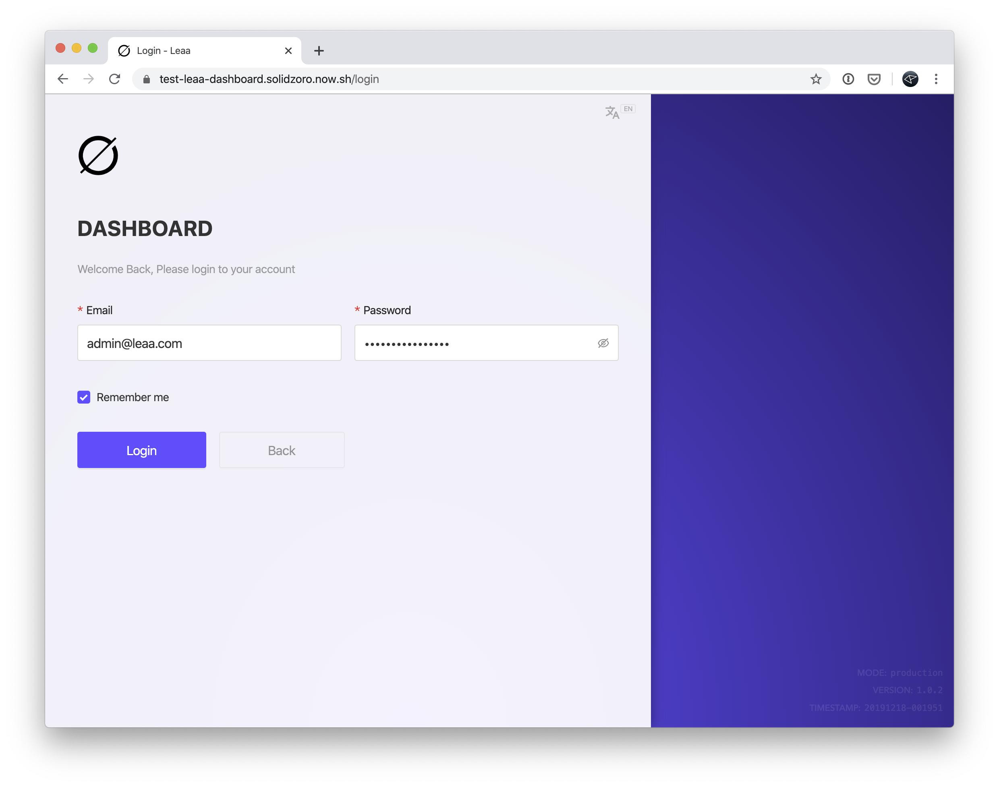
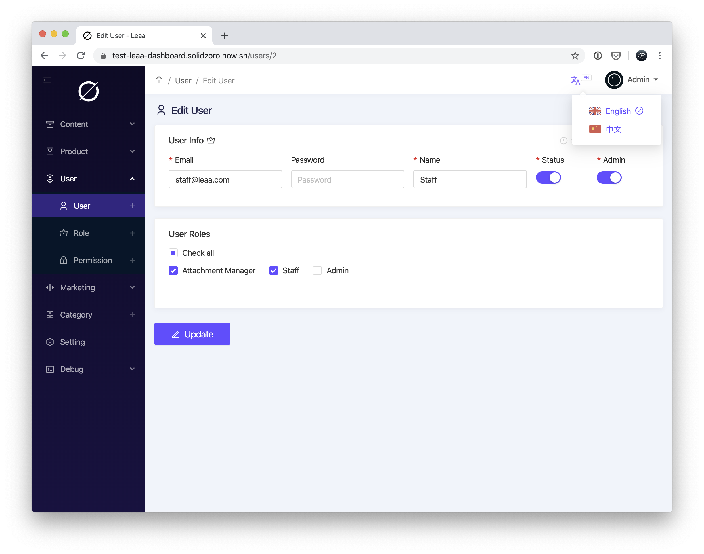
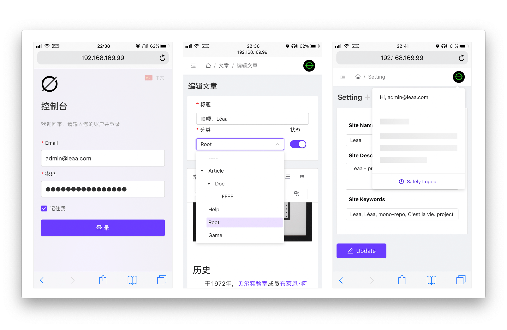
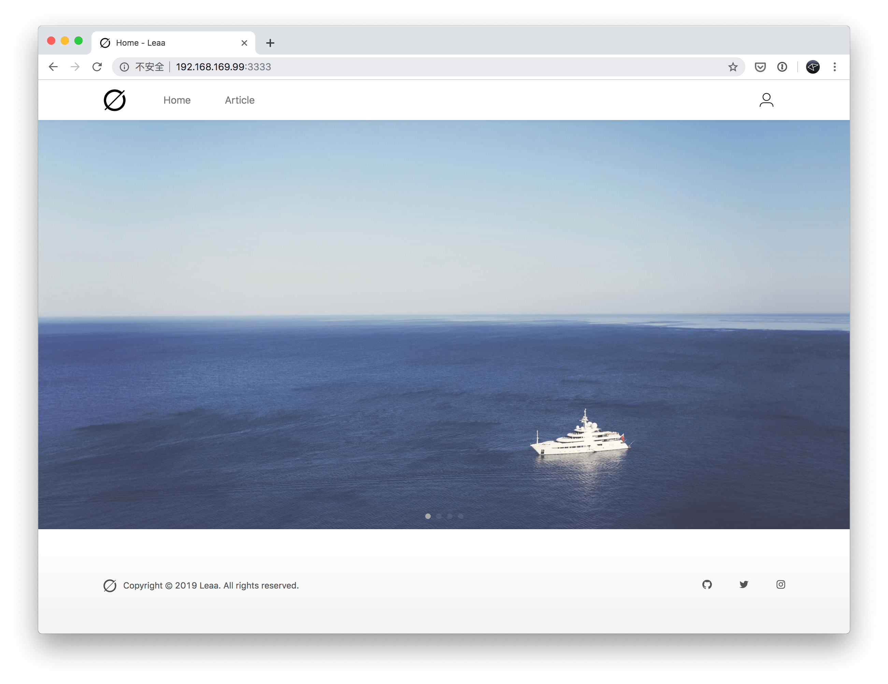
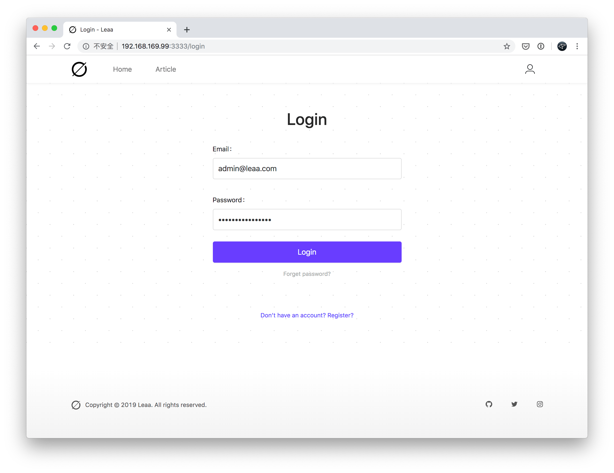
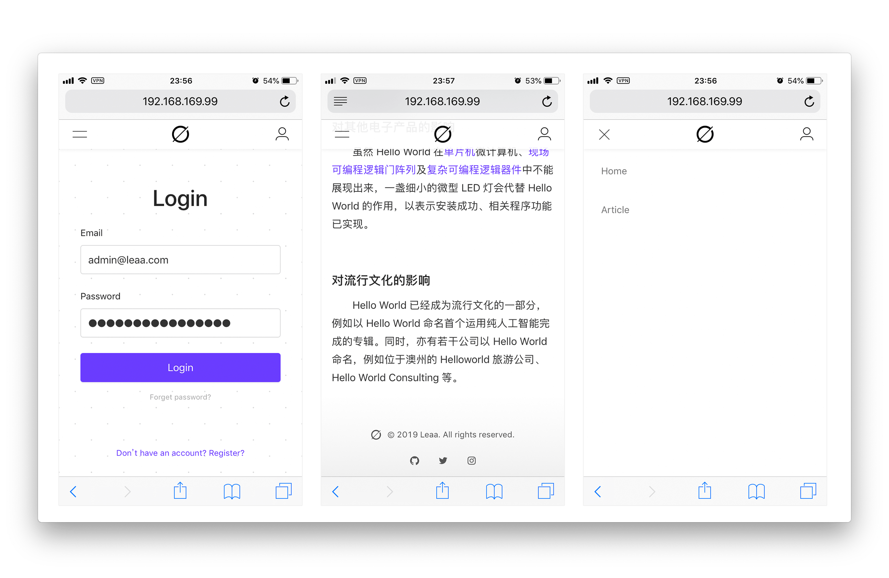

# Léaa (project 1d1h)

C'est la vie.

## **MONOREPO-PACKAGES**

- [x] \_leaa-common
- [x] leaa-api / backend (Nest.js + TypeGraphQL + Docker Compose)
  - [x] auth
  - [x] user
  - [x] role
  - [x] permission
  - [x] category (infinity level)
  - [x] article
  - [x] attachment local / oss
- [x] leaa-dashboard / dashboard (React + Antd + MobX + Apollo / GraphQL)
  - [x] auth
  - [x] user
  - [x] role
  - [x] permission
  - [x] category (infinity level)
  - [x] article
  - [x] attachment
- [x] leaa-www / website (Next.js + GraphQL)
  - [x] index
  - [x] article list
  - [x] article item
  - [x] login/logout
  - [x] swiper retina@2x / lazyload
- [ ] leaa-miniprogram / wechat-miniprogram (GraphQL + taro.js + taro-ui)

## **ONLINE DEMO**

- [📍 leaa-api-demo](https://test-leaa-api.herokuapp.com)
- [📍 leaa-dashboard-demo](https://test-leaa-dashboard.herokuapp.com)
- [📍 leaa-www-demo](https://test-leaa-www.herokuapp.com)

## **UI REVIEW**

### DASHBOARD

#### dashboard-login

#### dashboard-user-edit

#### dashboard-mobile

### WWW

#### www-index

#### www-login

#### www-mobile

## **DEV LOG**

### 2019-08-01 23:39

从 git commit 可以看出，这篇 DEVELOPMENTLOG（开发日志）是现在才开始写的，项目本来叫做 1d1h，也就是一天一小时的意思，想着业余时间把之前写前后端的经验汇集起来，做个 Blog --> CMS --> Sohp 的开源项目，包括 API / Dashboard / Website / Wechat Weapp / ReactNative(iOS / Android)，因为是一套 monorepo，类似 interface / entry 这些都是共用的所以感觉做成全平台也是一件很顺手的事情。

这个开发日志其实本来想早点写，但早期一大堆需要解决的问题，时间都用在开发上了，实在抽不出时间写记录，现在想想还真不应该这样，毕竟之前的一大堆问题如果记录下来了，其实就是隐形财富，虽然再次遇到了自己肯定懂如何解决，但就没办法 share 给其他人了。不过接下来的日志我会慢慢回顾就对了。

这里说一下我对 Dashboard 的理解吧，我觉得一个最小可用的的 Admin 应该包括。

- 用户（登录 / 注册）
- 角色
- 权限
- 文件上传
- 广告
- 分类
- 文章
- 设置

这几个模块写完基本上就可以拿来当 Blog 用了，特别是角色权限这块，如果有业务需求，基于这样的最小化的 Admin 开发基本上可以说也很简单了。我在以往的项目里处理权限权限已经很多次了，不过这次因为是 graphql，和之前的 restful 稍有区别，还是花了一些时间折腾的。

用 Nest.js 写了那么多的代码，其实算不上舒服，选用的原因其实还是看中了他的一整套范式以及武装到牙齿的 Typescript 支持。作者 @kamilmysliwiec 还是非常厉害的，nest.js 的一些封装实现非常精妙，最重要的还与各种技术相结合，落地了很多业务场景，这点真的非常赞的。

**`dashboard`** 上技术选型时常见的 React + Antd，不过这次因为全面上了 `hooks`，包括 Apollo 都是最新的 hooks beta 版本，整个项目几乎见不到 Class，但在大规模使用 hooks 后，感觉代码长得实在难看，如果以前 Class 代码清晰度打 10 分的话，hooks 只能打 5 分。当然，最明显的应该是赚了一个代码 Fn 共享，换做是 Class，想要 share Class 的 Fn，还是挺麻烦的。

**`www`** 部分没得选，只能是 Next.js 了，其实之前我有自研过一套较为完备的 React-SSR，但为了顺应浪潮，加上 @Guillermo 神在推上天天天吹，忍不住还是入手了 Next.js。我开始写 www 的时候刚好赶上 Next.js v9 发布，这是一个从 core 就开始用 TS 重写的船新版本。本以为用起来会很顺利，但没想到还是坑了……

毕竟需要集成 Antd，即意味着，Client 自己的 pages 代码需要对 less 用 cssModule，Antd 则不用，Server 那边则是看到 less 就扔。所以官方提供的 withLess 插件最多只能管 60%，剩下 40% 支持不到位。本来像 Next.js，CRA 这种就是把 webpack 包起来，前端毒瘤真不想你碰，配一下都是炒鸡麻烦。

但，我想说一个框架在项目初期给你几倍便利，那么它便会在项目后期给你带来几倍麻烦。CRA 如此，expo 如此，Next.js 也不例外，都是黑盒。那么我必须在两个小时内写一个 100% 符合我预期的 withPlugin 来，不然项目就卡了。翻了翻 Github 想看看有没有解决方案，但很不幸， v9 刚出根本找不到相关代码，看起来，只能 fuckingself 了。我虽对 webpack 很熟，但这 Next.js 在 webpack 上加了薄薄一层黑盒，写 withPlugin 有种被淹没在未知的 context 海洋中，是种非常憋屈的赶脚，不过还好，最终半小时搞定。提了个自带 resolve 的 [issue](https://github.com/zeit/next.js/issues/8054) 趁没被人发现赶紧 close 掉。希望给碰到同样问题的伙计在搜 issue 的时候带点帮助，毕竟需要 Next.js + antd withLess 的人还是很多的，特别是国内。

### 2019-08-15 20:45

时间过得好快，转眼半个月，最近没给 leaa 写什么新东西。重点放在了阿里云 OSS 整合这块。想要实现这样一个功能：

- Local 上传
- OSS 上传
- OSS 上传后备份到 Local
- OSS 上传 @2x 图片后，生成 @1x 上传回 OSS
- OSS 上传 @2x 图片后，生成 @1x 上传回 OSS 并备份到 Local
- 删除 OSS 需要触发删除 @1x 和 @2x 文件，并删除 Local 中的 @1x 和 @2x
- Local 和 OSS 是否开启均可配置
- 如 OSS 开启，为保证用户上传速度，所有上传直接走 OSS

其中过程还蛮艰辛的，涉及到 Local 和 OSS 之间的一些交互，而且因为直接走 OSS，所有请求不经 API，变成了等待 OSS 的 Callback，必须保证任何一步没做完都不能动 DB，勉强达到了幂等。
其实如果上传都走 API，然后由 API 统一处理再 put 到 OSS 会简单非常常常常常常多，我这么做主要是担心做某些活动的时候，如果涉及到上传文件，并发就会很大，服务器缓不过来。所以拿 OSS 先挡一下还是很有必要的。

基本上 www 和 api 以及 dashboard 就告一段落了。明天开始 miniprogram。
