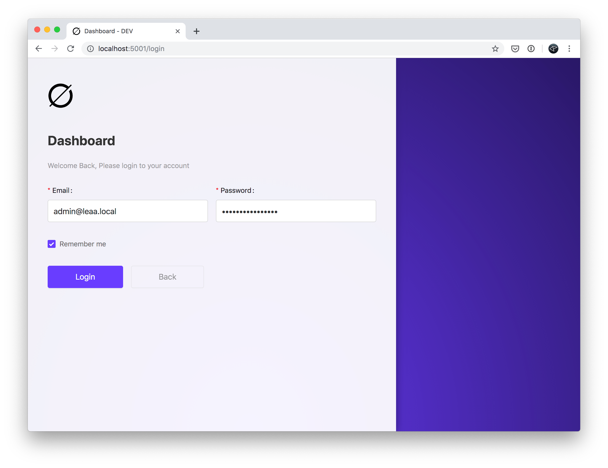
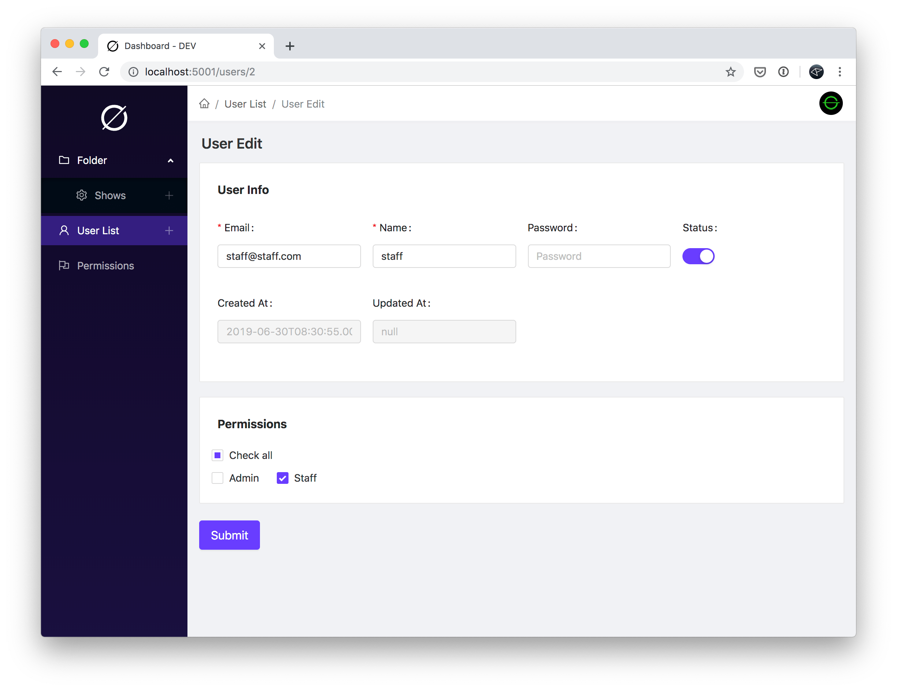

# Léaa (project 1h 4 1d. )

C'est la vie.

### **MONOREPO-PACKAGES**

- [x] \_leaa-common
- [x] leaa-api / backend (graphql + nest.js + docker-compose)
  - [x] auth
  - [x] user
  - [x] role
  - [x] permission
  - [x] category (infinity level)
  - [x] article
- [x] leaa-dashboard / dashboard (graphql + react.js + antd + mobx)
  - [x] auth
  - [x] user
  - [x] role
  - [x] permission
  - [x] category (infinity level)
  - [x] article
- [ ] leaa-www / website (graphql + next.js)
- [ ] leaa-miniprogram / wechat-miniprogram (graphql + taro.js + taro-ui)

### **REVIEW**

#### login

#### user edit

